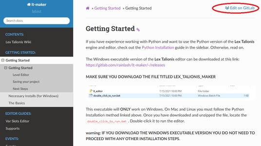
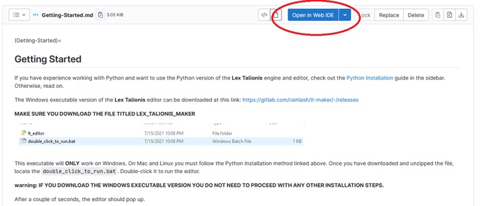
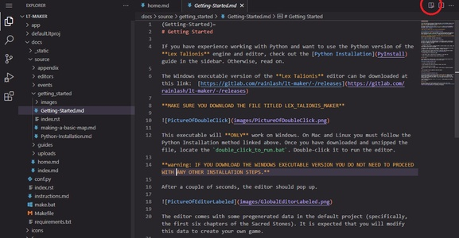
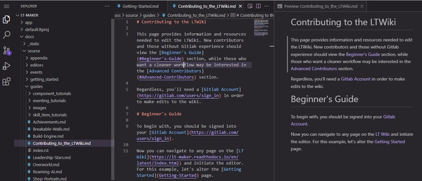
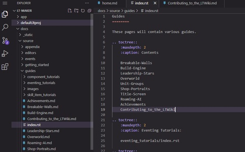
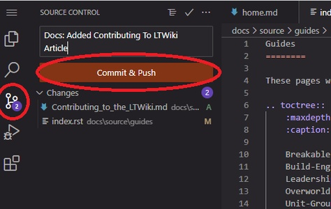
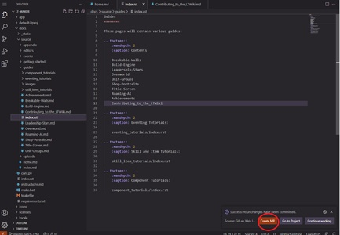
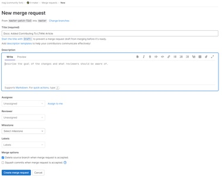

# Contributing to the LTWiki

This page provides information and resources needed to edit the LTWiki. New contributors and those without Gitlab experience should view the [Beginner's Guide](#Beginner's-Guide) section, while those who want a cleaner workflow may be interested in the [Advanced Contributors](#Advanced-Contributors) section.

Regardless, you'll need a [Gitlab Account](https://gitlab.com/users/sign_in) in order to make edits to the wiki.

## Beginner's Guide

To begin with, you should be signed into your [Gitlab Account](https://gitlab.com/users/sign_in).

Now you can navigate to any page on the [LT Wiki](https://lt-maker.readthedocs.io/en/latest/index.html) and initiate the editor. For this example, let's alter the [Getting Started](Getting-Started) page.

You can click on the `Edit on Gitlab` link on the top left. This will take you to the repository. You can now click on the `Open in Web IDE` button:

If you haven't done this before, it will prompt you to `Fork` the project. This will create a copy of the project on your account, which is necessary to make merge requests. Go ahead and click `Fork`:

Wait for the fork to finish. This will take a few seconds. The good news is, you only need to do this once. Once the initial fork is done, you will be free to make merge requests directly.

In either case, you should now be able to see the editor. If you want, you can click on the `Preview` button to see how the page is laid out. This helps in understanding the formatting syntax:

In either case, you can now make edits freely! Change whatever text you want (as long as it's for the good of the wiki). For this tutorial, let's make a new article. This one is actually easy to do. Just click `New File` in the left pane and it'll make a new article in the current directory. Use your best judgement as to where the article goes. I'm going to make an article in `Guides` called `Contributing to the LTWiki`:

If I add a new file, I also need to add it to the `index.rst` file in that directory:

Now that I've finished, how do I merge it? This step is quick. Go to the `Source Control` icon on the side.

Add a commit message describing your new article.

Finally, click `Commit and Push`.

Hit `Enter` through the dialogs - they aren't important. You'll see a dialog pop up telling you that your commit was a success. Now, you'll click the `Create MR` button, and it'll take you to the final page:

Where you can fill out some more information on what you changed. Finally, click the `Create Merge Request` button.

One of the owners of the repository will approve of your new article, and after that happens, it'll be there forever!

## Advanced Contributors

If you're already a developer, then you should be generally aware of how to [fork projects](https://docs.gitlab.com/ee/user/project/repository/forking_workflow.html), how to clone projects, and make upstream merge requests from your own repository.

The LT documentation is kept within the repository, in the `docs/` folder. The following commands assumes that the cwd is inside `docs/`.

### Dependencies

You can install the requirements for local compilation using `pip install -r requirements.txt`.

### Compilation

Use the commands found in `instructions.md` to compile the documentation.

### Editing

The documentation source can be found in `source/`.