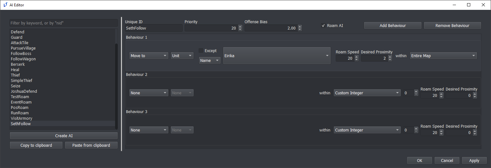
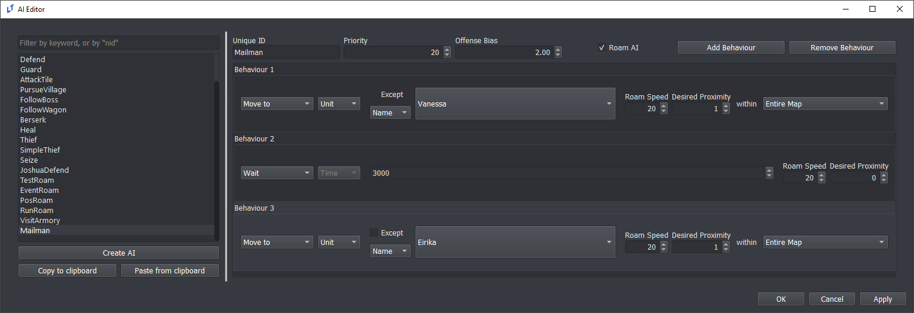
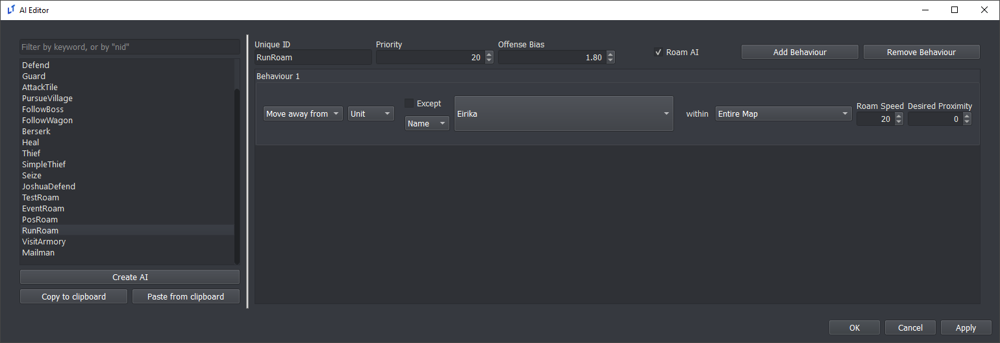

# Free Roam AI

You may wish to create moving units in your free roam levels. Having units that move around your city or castle can certainly help make it feel more alive!

This tutorial will go over some example AIs you can create using the AI system that exists in Lex Talionis.

Of the available AI behaviours, only a few have an effect in free roam. Only Move To, Move Away From, Wait, and Interact maintain functionality.

## Followers

In many JRPGs party members will follow the lead unit around the map. We'll implement that here.

First, let's set up an AI for our follower.

There's nothing too complicated about this. At the top, you'll notice that we've checked "Roam AI?" - this simply tells the game to consider units with this AI during free roam. It does not exclude the AI from function during normal gameplay, however.

To the right in the behaviour boxes, Roam Speed is at its default of 20 and Desired Proximity is at 2. Roam Speed is the speed at which the unit moves. As the value gets **closer to 0** the speed of the unit **increases**. Desired Proximity is how close to a given target the unit needs to be before it stops. The default is 0, which works well if you want a unit to move to a particular position. However, we want some personal space, so I've set it to 2.

Below that, we've created a behaviour identical to what you might see in normal gameplay. A unit with this AI will try to continuously move to a unit named Eirika. For your purposes, change the name to your roaming unit. You can use any unit identifier as well, be it class, tag, faction, or party.

Now to assign it. You'll need to have either the "Free Roam?" box checked in the level or have an event in your level that calls the change_roaming command in order to be able to assign Roam AIs. However, so long as you meet either of those two conditions you should see a Roam AI selection box next to your normal AI selection box.

## Mailman

Delivering the mail is no simple task! Let's create an AI that will have a unit get the mail from one target and give it to a second target.

The settings at the top are just about the same. This mailman is a bit more touchy, but that's it.

The behaviours are more interesting, however. The unit will first find a unit Vanessa and move to her. Once he reaches Vanessa that behaviour will be considered complete, and they'll move to their next, which is Wait.

Wait is a new behaviour that only affects units in free roam. If an AI with the Wait behaviour is asked to select their move in normal gameplay the Wait behaviour will be silently skipped. It takes an integer value that corresponds with the amount of time you would like the unit to wait. The higher the number, the longer they'll wait.

Once they're done waiting, the unit will move to Eirika. Once that third behaviour completes they'll wrap back around to their first, meaning they'll move back to Vanessa.

While we only have three behaviours here, you can add more using the "Add Behaviour" button in the top right.

## Escapee

Not everyone wants to be your friend, so let's make an AI that will attempt to flee from the roaming unit.

Again, a very simple task. The unit will try to flee if a unit named Eirika (who happens to be our roaming unit) tries to get close. Though he's far slower than us currently, we could turn his speed up to make quite the chase!

A note on combining this behaviour with others: when Eirika gets too close a unit with this AI will find a spot to flee to and run there. They will then consider that behaviour complete. This isn't a consideration if they only have one behaviour, as they'll keep checking to make sure Eirika isn't too close, but if you gave them a Wait behaviour afterwards they would always Wait that amount of time, even as Eirika gets closer. That isn't necessarily bad, but is something to be considered.