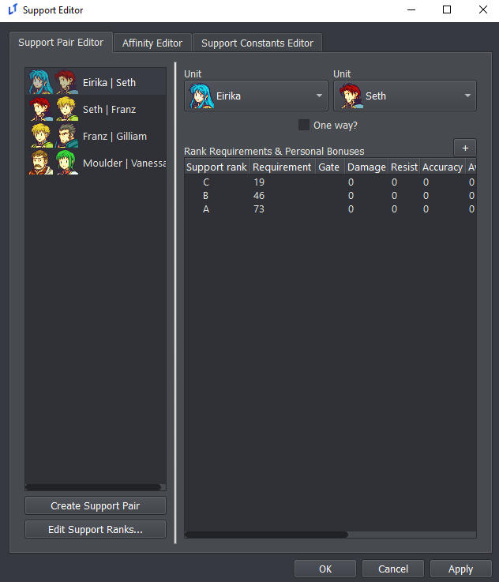
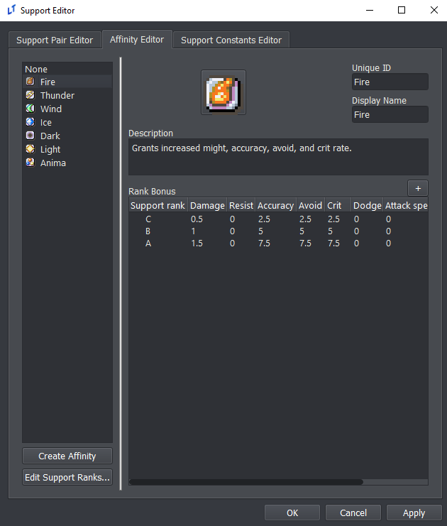
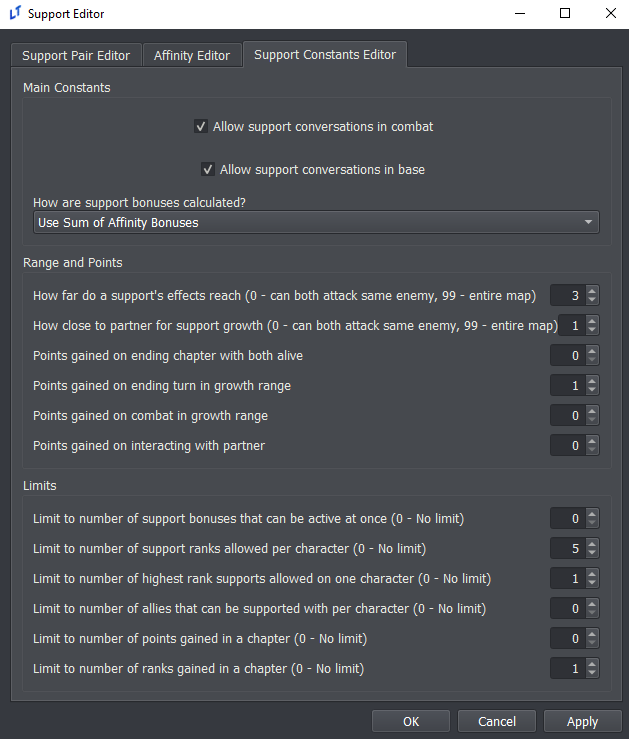

# Supports

_Authored by Beccarte_
_last updated 2023-02-27_

## Enabling Supports

To enable supports, go the Constants editor and make sure **support** is checked.

In-game, support points will not accumulate until you enable the game variable **_supports** in an event script:

`game_var;_supports;True`

This is useful if, for example, you don't want support points to be awarded until a specific point in the game. This variable only needs to be set once unless you wish to disable supports again later on.

## Configuring Supports

Open the Supports editor from the main menu.

1. Support Pair Editor

This tab allows you to define supports between pairs of units (left) as well as set rank requirements and specific support bonuses (right). First, create/select a support pair on the left, and right-click the panel on the right to create a new support rank. Each support rank can be assigned the following properties:

**ID**: this is used elsewhere to reference the support rank.
**Requirement**: support points needed to unlock this rank.
**Gate**: if this is not empty, this rank is locked until a game variable with a name matching the entered text is set to **True**.
**Stats**: the remaining fields are stat changes that are applied when this support rank is unlocked. 

Note that the stat changes are not cumulative, so changes from previously unlocked ranks will be overridden. These stat bonuses are applied on top of the bonuses from the units' affinities (if any), which are described in the next section.

2. Affinity Editor

In the GBA Fire Emblem titles, each unit has an affinity that helps determine the stat bonuses conferred by that unit's support ranks. This editor tab defines the different affinities (left) and their statistical effects (right). Like in the Support Pair Editor, each affinity can have multiple ranks specified on the right-hand panel. The IDs for these support ranks should match the rank IDs in the Support Pair Editor.

Each affinity defines it's own set of stat bonuses at each support level. These bonuses are NOT cumulative. Each row is taken individually, so you could easily do things like have negative bonuses for a middle support conversation (before the characters inevitably make up).

3. Support Constants Editor

This tab controls how the support system behaves. The top box (Main Constants) determines when support conversations can take place, what happens when a support partner dies, and how stat bonuses from the Affinity Editor are calculated. Note that the stat calculation mode defined here has no effect on the pair-specific stat bonuses in the Support Pair Editor.

The center box (Range and Points) determines where and how support points are gained. This includes limits on how close the support partners must be to one another and whether they must interact. For example, in the GBA games support points are gained each turn by units standing near one another. In contrast, Radiant Dawn grants a single support point if both units are deployed in a chapter and survive. If you opt for the latter type of system, make sure the number of points required for each rank in the Support Pair Editor is realistic.

## Support Conversations

In order for units to gain support points with one another, they must do the actions you specified in the Support Constants editor. This could be waiting next to one another, interacting with one another, or just being deployed in the same chapter together.

When two units that are capable of supporting each other gain enough points to unlock a new support rank, they'll be able to select the "Support" action from the menu. This action fires the `on_support` event trigger.

Support conversations themselves are very similar to Talk conversations in overall structure. Create an event with the `on_support` trigger. In the script, you can use `unit` and `unit2` to reference the units that are in the support conversation, and `support_rank_nid` is the ID of the support rank.

So if you wanted an event to show when Eirika and Seth have their C support, your condition for that event would be:

`check_pair('Seth', 'Eirika') and support_rank_nid == 'C'`
